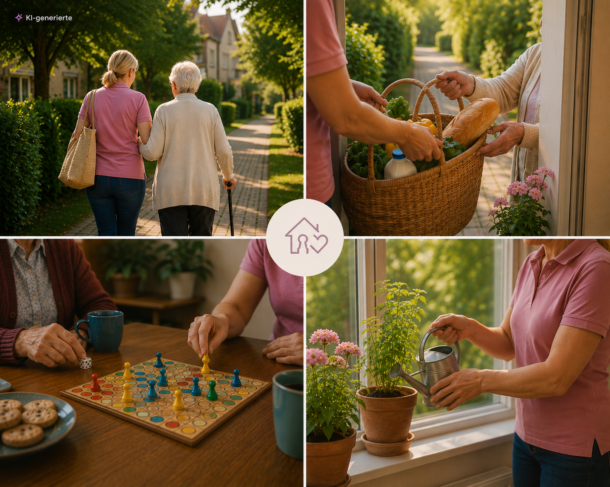

Alltagsfreund Jenny

Website für Alltagsfreund Jenny – Haushalt & Nachbarschaftshilfe.

Die Website stellt das Angebot, die persönliche Vorstellung, Nachbarschaftshilfe, Sterbe- und Trauerbegleitung sowie die Kontaktmöglichkeit übersichtlich dar.

Projektstruktur

/
├── index.html
├── impressum.html
├── datenschutz.html
├── qualifikationen.html
├── leistungen.html
└── assets/
    ├── logo.png
    ├── Jennymitoma.png
    ├── NBH.png
    ├── Sehrgut.JPG
    ├── trauer.png
    └── erstehilfe.png

Die Dateinamen und Pfade müssen mit den tatsächlichen Dateien im assets-Ordner übereinstimmen.

Bereiche der Website

Navigation

Start

Über mich

Leistungen

NBH

Trauerbegleitung

Kontakt

Die Navigation ist auf Desktop, Tablet und Smartphone responsive umgesetzt.

Über mich / persönlicher Bereich

Der Bereich „Hallo, ich bin Jenny“ stellt Jenny und ihre persönliche Motivation vor.

Als Bild wird assets/Sehrgut.JPG verwendet. Das Foto wird mit einem weichen Übergang in den Hintergrund eingebunden, damit Bild und Text als zusammenhängender Bereich wirken.

Startbereich / Hero

Der Startbereich vermittelt das zentrale Angebot von Alltagsfreund Jenny und enthält:

persönliche Begrüßung

Beschreibung der Unterstützung

Call-to-Action-Buttons

Vertrauensmerkmale

das Bild assets/Jennymitoma.png

Das Bild wird als Teil des Hero-Bereichs eingebunden und responsive für Desktop, Tablet und Smartphone angepasst.

Leistungen

Die Website stellt unter anderem folgende Unterstützungsangebote dar:

Haushalt & Wäsche

Einkaufen & Besorgungen

Seniorenbetreuung

Nachbarschaftshilfe

Sterbe- & Trauerbegleitung

Trauergruppen

Die ausführlichen Leistungen und Preise befinden sich auf der separaten Seite leistungen.html.

Nachbarschaftshilfe

Der Bereich „Nachbarschaftshilfe in Burgstädt und Umgebung“ beschreibt die praktische Unterstützung im Alltag, Begleitung und mögliche Unterstützung über den Entlastungsbetrag.

Dazu wird assets/NBH.png verwendet.

Trauer- & Sterbebegleitung

Der Bereich beschreibt die persönliche Begleitung von Menschen am Lebensende, Angehörigen und Menschen in Trauer.

Dazu wird assets/trauer.png verwendet.

Kontakt

Kontaktformular mit:

Vor- und Zuname

Telefonnummer

E-Mail-Adresse

Freitext

clientseitiger Validierung

Versand über Web3Forms

Erfolgs- und Fehlermeldungen

Statusanzeige während des Versands

Die Web3Forms-Konfiguration sollte bei einer Veröffentlichung nicht unnötig verändert werden.

Qualifikationen

Die separate Seite qualifikationen.html enthält unter anderem:

Betreuungskraft §§43b, 53b SGB XI

Sterbe- und Trauerbegleitung

Erste-Hilfe-Kurs

Informationen zur Nachbarschaftshilfe und Anerkennung

Das Erste-Hilfe-Zertifikat verwendet assets/erstehilfe.png.

Rechtliche Seiten

Vorhanden sind:

impressum.html

datenschutz.html

Technische Grundlage

Die Website verwendet:

HTML5

CSS3

Vanilla JavaScript

CSS Custom Properties

Responsive Design

IntersectionObserver für Scroll-Animationen

Google Fonts

Playfair Display

Caveat

DM Sans

Es werden keine Frameworks wie React, Vue oder Bootstrap benötigt.

Lokale Verwendung

Die Website kann direkt über einen lokalen Webserver geöffnet werden.

Beispielsweise mit VS Code und Live Server oder über einen einfachen lokalen Server:

python -m http.server 8000

Danach im Browser:

http://localhost:8000

Bilder und Assets

Alle Bilder werden über relative Pfade aus dem assets-Ordner geladen.

Beispiele:

Für den Bereich „Über mich“:

background-image: url('./assets/Sehrgut.JPG');

Für den Hero-Bereich:

background-image: url('./assets/Jennymitoma.png');

Responsive Design

Die Website enthält eigene Anpassungen für:

Desktop

Tablet / kleinere Bildschirme

Smartphone

Die Tablet-Ansicht besitzt ein eigenes Layout, ohne das Desktop-Layout unnötig zu verändern.

Auf Smartphones werden insbesondere Navigation, Hero-Bereich, Buttons, Karten und Bildbereiche angepasst.

Bei Änderungen sollten alle drei Darstellungsbereiche geprüft werden.

Wichtige Hinweise vor einer Veröffentlichung

Vor einem Deployment prüfen:

alle HTML-Dateien vorhanden

assets/ vorhanden

assets/logo.png vorhanden

assets/Jennymitoma.png vorhanden

assets/NBH.png vorhanden

assets/Sehrgut.JPG vorhanden

assets/trauer.png vorhanden

assets/erstehilfe.png vorhanden

Impressum vorhanden

Datenschutzerklärung vorhanden

Qualifikationen-Seite vorhanden

Leistungs- und Preisliste vorhanden

Navigation auf allen Seiten prüfen

alle Absprünge innerhalb der Startseite prüfen

Kontaktformular testen

Website auf Desktop testen

Website auf Tablet testen

Website auf Smartphone testen

Bilddarstellung insbesondere bei „Über mich“, Hero und NBH prüfen

Änderungsprinzip

Bei zukünftigen Anpassungen sollte darauf geachtet werden, bestehende Bereiche nicht unnötig zu verändern.

Insbesondere gilt:

Gezielte Änderungen nur an dem gewünschten Bereich vornehmen und bestehende Funktionalität unverändert lassen.

Vor einer Änderung möglichst genau feststellen, welche CSS-Regel oder welcher HTML-Bereich für das gewünschte Element zuständig ist.

Bei Responsive-Anpassungen immer darauf achten, ob die Änderung nur für Desktop, Tablet oder Smartphone gelten soll.

Das verhindert die klassische Website-Entwicklungsmethode:

„Ich wollte nur ein Bild ändern und plötzlich funktioniert das Kontaktformular nicht mehr.“ 😄

Tests & Qualitätssicherung

Responsive Layout für Desktop, Tablet und Smartphone geprüft

Tablet-Breakpoint im Bereich 769–992 px separat getestet

Smartphone-Ansicht bis 768 px geprüft

Navigation und interne Verlinkungen geprüft

Darstellungsprobleme bei Bildern und Layout-Übergängen gezielt korrigiert

Änderungen am bestehenden Layout möglichst isoliert vorgenommen, damit funktionierende Bereiche nicht unbeabsichtigt verändert werden

