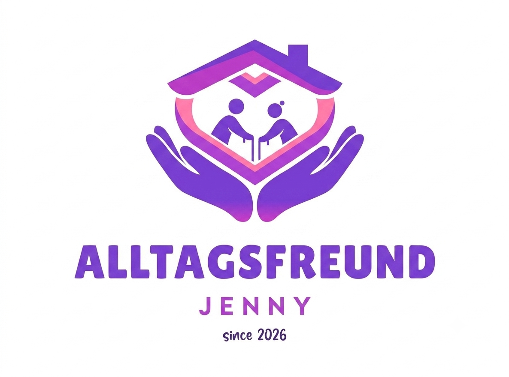
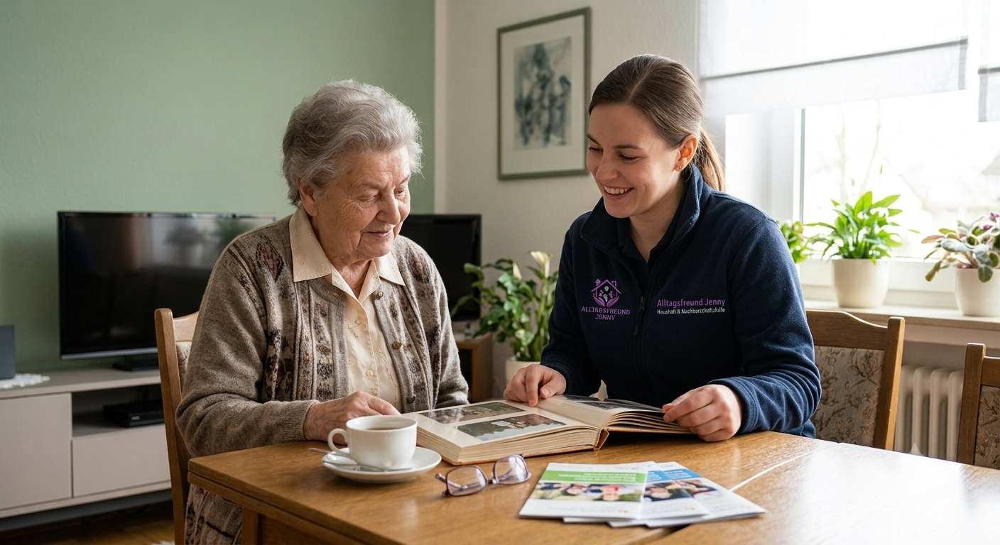
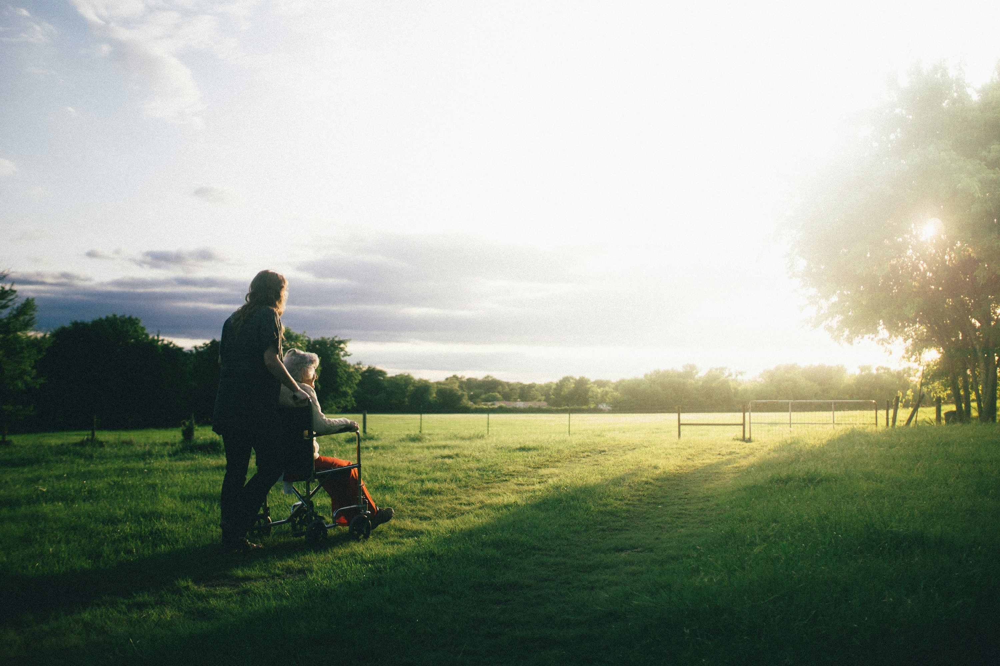

Alltagsfreund Jenny

Website für Alltagsfreund Jenny – Haushalt & Nachbarschaftshilfe.

Die Website stellt das Angebot, die persönliche Vorstellung, Nachbarschaftshilfe und die Kontaktmöglichkeit übersichtlich dar.

Projektstruktur

/
├── index.html
├── impressum.html
├── datenschutz.html
├── qualifikationen.html
└── assets/
    ├── logo.png
    ├── alltagshelfer1r.png
    ├── nbh.jpg
    └── Sehrgut.jpg

Die Dateinamen und Pfade müssen mit den tatsächlichen Dateien im assets-Ordner übereinstimmen. Besonders Sehrgut.jpg wird im Bereich „Über mich“ als Hintergrundbild verwendet.

Bereiche der Website

Navigation

Start

Leistungen

Nachbarschaftshilfe

Kontakt

Hero / Startbereich

Der Startbereich vermittelt das zentrale Angebot von Alltagsfreund Jenny und enthält:

persönliche Begrüßung

Beschreibung der Unterstützung

Call-to-Action-Buttons

Vertrauensmerkmale

bestehendes Bild assets/alltagshelfer1r.png

Leistungen

Vier Leistungsbereiche:

Ein Zuhause zum Wohlfühlen

Sicher & Gemeinsam unterwegs

Zeit für das Wesentliche

Sterbe- & Trauerbegleitung

Über mich

Der Bereich „Hallo, ich bin Jenny“ stellt Jenny und ihre persönliche Motivation vor.

Hier wird assets/Sehrgut.jpg als Hintergrundbild verwendet. Der Text liegt auf einer leicht transparenten Fläche, damit das Foto sichtbar bleibt und die Lesbarkeit erhalten wird.

Wichtig: Das Bild wird ausschließlich in diesem Bereich verwendet.

Nachbarschaftshilfe

Informationen zur Nachbarschaftshilfe und Entlastungsleistungen inklusive Bild assets/nbh.jpg.

Kontakt

Kontaktformular mit:

Vor- und Zuname

Telefonnummer

E-Mail-Adresse

Freitext

clientseitiger Validierung

Versand über Web3Forms

Technische Grundlage

Die Website verwendet:

HTML5

CSS3

Vanilla JavaScript

Google Fonts

Playfair Display

DM Sans

CSS Custom Properties

Responsive Design

IntersectionObserver für Scroll-Animationen

Es werden keine Frameworks wie React, Vue oder Bootstrap benötigt.

Lokale Verwendung

Die Website kann direkt über einen lokalen Webserver geöffnet werden.

Beispielsweise mit VS Code und Live Server oder über einen einfachen lokalen Server:

python -m http.server 8000

Danach im Browser:

http://localhost:8000

Bilder

Alle Bilder werden über relative Pfade aus dem assets-Ordner geladen.

Beispiele:

Für den Bereich „Über mich“:

background-image: url("./assets/Sehrgut.jpg");

Kontaktformular

Das Kontaktformular verwendet Web3Forms für die Übermittlung.

Die Formularlogik befindet sich direkt im HTML und übernimmt unter anderem:

Prüfung der E-Mail-Adresse

Prüfung der Telefonnummer

Statusanzeige während des Versands

Erfolgs- und Fehlermeldungen

Die Web3Forms-Konfiguration sollte bei einer Veröffentlichung nicht unnötig verändert werden.

Responsive Design

Die Website enthält Breakpoints für:

Desktop

Tablet / kleinere Bildschirme

Smartphone

Auf Smartphones werden Navigation, Hero-Bereich, Buttons und Karten automatisch angepasst.

Wichtige Hinweise

Vor einer Veröffentlichung prüfen

Alle Dateien im richtigen Verzeichnis vorhanden

assets/logo.png vorhanden

assets/alltagshelfer1r.png vorhanden

assets/nbh.jpg vorhanden

assets/Sehrgut.jpg vorhanden

Impressum vorhanden

Datenschutzerklärung vorhanden

Qualifikationen-Seite vorhanden

Kontaktformular testen

Website auf Desktop und Smartphone testen

Bilddarstellung im Bereich „Über mich“ prüfen

Änderungsprinzip

Bei zukünftigen Anpassungen sollte darauf geachtet werden, bestehende Bereiche nicht unnötig zu verändern.

Insbesondere gilt:

Gezielte Änderungen nur an dem gewünschten Bereich vornehmen und bestehende Funktionalität unverändert lassen.

Das verhindert die klassische Website-Entwicklungsmethode „Ich wollte nur ein Bild ändern und plötzlich funktioniert das Kontaktformular nicht mehr“. 😄
